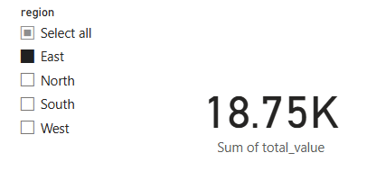
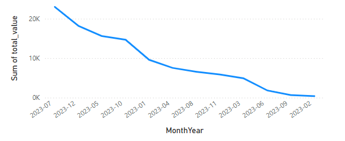
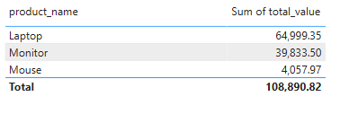

# Datacrafter
This repository contains a complete end-to-end data pipeline project designed to process raw sales data, apply data quality checks and transformations, normalize the dataset into a relational database, and visualize actionable insights using Power BI.

---

## 📁 Repository Contents

| File/Folder                            | Description |
|----------------------------------------|-------------|
| `sales_data.json`                      | Raw sales transactions in semi-structured JSON format |
| `Sales_Data.db`                        | Normalized SQLite database with structured `customers`, `products`, and `transactions` tables |
| `data_quality.log`                     | Logs detailing data quality observations (INFO, WARNING, ERROR) |
| `1.Data_Pipeline_Development.ipynb`    | Jupyter notebook with data extraction, transformation, and loading (ETL) processes |
| `5.Data Visualization with Power BI.pbix` | Power BI report containing interactive dashboards and visualizations |

---

## 📊 Project Workflow Overview

### 1. **Raw Data Source**
- **File**: `sales_data.json`
- **Structure**: Nested JSON records with the following fields:
  - `transaction_id`
  - `customer_id`
  - `product` (object with `id`, `name`, `category`, `price`)
  - `quantity`
  - `date`
  - `region`

- **Common Issues Identified**:
  - Duplicate `transaction_id` entries
  - Missing `customer_id` in some transactions
  - Negative `quantity` values

---

### 2. **Data Quality Logging**
- **File**: `data_quality.log`
- **Purpose**: Captures informational and error logs during data validation
- **Key Entries**:
  - Duplicate transaction IDs detected
  - Missing customer data
  - Inconsistent or erroneous records

---

### 3. **Data Transformation & Normalization**
- **File**: `1.Data_Pipeline_Development.ipynb`
- **Tools**: Python (Pandas, SQLite3)
- **Functionality**:
  - Loads and parses the JSON dataset
  - Handles data anomalies (e.g., nulls, negative values)
  - Deduplicates records
  - Extracts normalized tables:
    - `customers`
    - `products`
    - `transactions`
  - Stores cleaned and structured data in `Sales_Data.db`

---

### 4. **Normalized Database**
- **File**: `Sales_Data.db`
- **Database Schema**:
  - `customers (customer_id TEXT PRIMARY KEY)`
  - `products (product_id TEXT PRIMARY KEY, name TEXT, category TEXT, price REAL)`
  - `transactions (transaction_id TEXT PRIMARY KEY, customer_id TEXT, product_id TEXT, quantity INTEGER, date TEXT, region TEXT, FOREIGN KEY...)`

---

### 5. **Visualization & Insights**
- **File**: `5.Data Visualization with Power BI.pbix`
- **Platform**: Microsoft Power BI Desktop
- **Dashboards Include**:
  - Regional sales distribution
  - Sales trends over time
  - Top-performing products
  - Customer purchase behavior
  - KPIs and summary statistics

---

## 🚀 How to Use This Repository

### Requirements
- Python 3.7+
- Jupyter Notebook
- SQLite or DB Browser for SQLite
- Power BI Desktop

### Steps
1. Clone the repository.
2. Open and run `1.Data_Pipeline_Development.ipynb` to process and load the raw data.
3. Explore the database using `Sales_Data.db`.
4. Launch `5.Data Visualization with Power BI.pbix` in Power BI Desktop to interact with the dashboards.

---

## 🧪 Example Use Cases
- Sales and marketing analytics
- Regional performance benchmarking
- Customer segmentation
- Inventory and demand forecasting

---

## 🛠️ Future Improvements
- Integration with automated ETL pipelines (e.g., Apache Airflow)
- Cloud-hosted database (e.g., PostgreSQL)
- Power BI Service publishing and scheduled refresh
- Real-time data ingestion with API integration

---

## 📄 License

This project is licensed under the MIT License. See the [LICENSE](LICENSE) file for details.

---

## 🙋‍♀️ Questions or Contributions?

Feel free to open an issue or pull request for suggestions, improvements, or contributions to the project.

---

**Author**: Nabeeha Ejaz 
**Last Updated**: 28 May 2025
